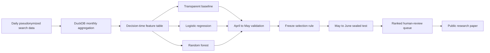

<div align="center">

# Refresh Opportunity Ranking Under Temporal Shift

### A time-aware machine-learning study for prioritizing human content review

[](https://hasankhan05.github.io/flyrank-ml-internship/)
[](work/notebooks/capstone.ipynb)
[](LICENSE)

An applied Search Intelligence project built on pseudonymized FlyRank search-performance data.

</div>

---

## Overview

Content teams often have more pages worth investigating than they can review. This project studies a narrower operational question:

> **Which already-visible content items should receive limited human review before the next month?**

The system aggregates daily search measurements into monthly page-level examples, ranks eligible content by observed future-decline risk, and translates the result into a review queue with reason codes and confidence tiers. It compares a fixed, readable baseline with logistic regression and random forest under a chronological validation design.

The goal is decision support. A high score recommends investigation; it does not authorize an automatic refresh, rewrite, consolidation, or deletion.

## Research design

| Component | Definition |
|---|---|
| Lane | Refresh / Content Opportunity Scoring |
| Unit of analysis | One pseudonymized content item at one monthly decision anchor |
| Target | `future_decline = 1` when next-month impressions are below 80% of feature-month impressions |
| Eligibility | At least 100 feature-month impressions and 20 measured GSC days in both feature and outcome months |
| Primary metric | Precision@50, matching a fixed human-review capacity |
| Training anchors | September 2025 through March 2026 |
| Validation | April 2026 features predicting May 2026 |
| Sealed evaluation | May 2026 features predicting June 2026, opened once after model selection |
| Operational output | Ranked top-50 human-review queue with actions, reasons, and confidence |

The chronological split is central to the study. A random split would mix observations from different time periods and give a weaker picture of how the ranking behaves when deployed on a later month.



## Data

The project uses the public-safe FlyRank warehouse release `flyrank_pseudonymized_warehouse_release_v20260703`.

| Source | Scale | Role |
|---|---:|---|
| `dim_clients` | 104 clients | Coverage dates and pseudonymized grouping context |
| `dim_content` | 519,606 content records | Safe structured content metadata |
| `fact_content_daily_performance` | 78,835,655 daily rows | Search and analytics measurements from 2025-01-27 to 2026-06-30 |

Daily observations are aggregated by month, `client_hash_id`, and `content_hash_id` before modelling. The feature pipeline uses measured availability flags rather than treating unavailable analytics as ordinary zero performance.

The final-month sample is not used to develop the target. June 2026 is reserved as the natural outcome window for the sealed evaluation.

## Feature and leakage controls

Predictive inputs cover:

- current and prior impressions and clicks;
- CTR and prior-month impression momentum;
- measured average position and an explicit position-availability flag;
- content age, content type, and search volume.

The project deliberately excludes:

- next-month measurements and label-derived fields;
- client and content identifiers as predictive features;
- raw names, domains, URLs, titles, and queries;
- provider or model metadata unrelated to the editorial decision;
- fixed query-window fields whose dates overlap later outcome windows.

Missing numeric values are imputed within each training pipeline, with missingness indicators. Logistic-regression inputs are standardized, content type is imputed and one-hot encoded, and all candidate models use a fixed random seed of `42`.

The data-contract exercise also demonstrates leakage directly. An honest five-feature grouped-holdout model reached ROC AUC `0.664`; copying the label into the feature set produced `1.000`. The copied field was then removed. The exercise shows why near-perfect performance can be evidence of a broken evaluation rather than a strong model.

## Signal audit

Candidate signals were inspected on 341,546 training examples from 41 pseudonymized clients before the capstone comparison was finalized.


The audit retained exposure, nonlinear momentum, measured position, content age, and CTR as useful directional inputs. Active days remained reviewer context. Raw GSC/GA4 availability counts and sparse engaged-session measurements were excluded from prediction because they reflect measurement access as well as content behaviour.

These are observational relationships. They help rank investigation priority but do not identify a causal refresh effect.

## Baseline and models

### Transparent baseline

The frozen baseline assigns a score from 0 to 100 using four fixed components:

| Component | Weight |
|---|---:|
| Log-scaled current exposure | 40% |
| Negative prior-month momentum | 30% |
| Established-content age | 20% |
| Opportunity around a valid visible position | 10% |

Missing prior history contributes no momentum risk, while unavailable position contributes no position-opportunity score.

### Learned comparisons

- **Logistic regression:** median imputation, missingness indicators, scaling, and one-hot encoded content type.
- **Random forest:** 300 trees, `min_samples_leaf=20`, deterministic seed `42`, and the same declared feature set.

All methods are evaluated on identical rows. The model-selection rule was declared before the sealed month was opened.

## Results

| Split and method | Rows | Base rate | Precision@50 | Average precision | Lift@50 |
|---|---:|---:|---:|---:|---:|
| Validation — fixed baseline | 93,474 | 53.79% | **66%** | 53.34% | 1.23× |
| Validation — logistic regression | 93,474 | 53.79% | 40% | 52.94% | 0.74× |
| Validation — random forest | 93,474 | 53.79% | 54% | **60.42%** | 1.00× |
| Sealed — fixed baseline | 93,048 | 64.04% | 68% | 67.02% | 1.06× |
| Sealed — random forest | 93,048 | 64.04% | **98%** | **72.22%** | **1.53×** |


The fixed baseline won the declared validation metric and therefore remained the selected operational method. The random forest ranked the broader validation population better by average precision, but it did not beat the baseline at the exact top-50 cutoff used for selection.


The order reversed on the sealed month: random forest achieved 98% Precision@50 compared with 68% for the selected baseline. This result was not used to retune the system. It is reported as evidence of temporal instability, not proof that the learned model will always be superior.

The grouped sealed diagnostic covered 40 eligible clients. Macro average precision was `0.515` for the baseline and `0.575` for random forest.

## Ranked action layer

The selected baseline ranks 93,048 eligible May-anchor items and exports the first 50 for human review.


All 50 highest-ranked items receive `refresh_or_expand_review` because they show measured negative prior momentum. Among them:

- 34 also carry a meaningful-exposure reason;
- all 50 have visible-position context;
- 20 are assigned high confidence;
- 30 are assigned medium confidence.

The review playbook asks an editor to verify intent, accuracy, topic coverage, seasonality, tracking continuity, competing content, and business importance before recommending a change. Positive-momentum items should be protected from unnecessary edits, while incomplete-evidence cases should be monitored instead of forced into an action.

## What the project found

1. **A transparent rule can be difficult to beat at a strict operational cutoff.** The baseline outperformed both learned candidates at validation Precision@50.
2. **Metric choice changes the conclusion.** Random forest had stronger validation average precision even though its top-50 precision was lower.
3. **Time changes the problem.** The observed decline rate increased from 53.79% in validation to 64.04% in the sealed period, and method ordering reversed.
4. **Validation is part of the system.** Base-rate drift, missingness, multiple review capacities, and client-level behaviour must be monitored alongside model scores.
5. **Ranked output still requires judgment.** Exposure and momentum can prioritize review, but they cannot determine the correct editorial intervention by themselves.

## Research notebooks

| Stage | Notebook | Purpose |
|---|---|---|
| Research question | [`w01_research_question.ipynb`](work/notebooks/w01_research_question.ipynb) | Defines the lane, decision, action, and cost of error |
| ML framing | [`w02_ml_task_framing.ipynb`](work/notebooks/w02_ml_task_framing.ipynb) | Frames the work as capacity-constrained ranking |
| Data contract | [`w03_data_contract.ipynb`](work/notebooks/w03_data_contract.ipynb) | Verifies grain, availability, five features, and the leakage trap |
| Feature construction | [`w03_feature_leakage_check.ipynb`](work/notebooks/w03_feature_leakage_check.ipynb) | Builds the full page-month feature vector and leakage checks |
| Signal audit | [`w04_signal_audit.ipynb`](work/notebooks/w04_signal_audit.ipynb) | Measures candidate-signal effects and records verdicts |
| Baseline | [`w04_baseline_score.ipynb`](work/notebooks/w04_baseline_score.ipynb) | Builds a readable rule and reviews ranked candidates |
| Model comparison | [`w05_model.ipynb`](work/notebooks/w05_model.ipynb) | Compares the baseline, logistic regression, and random forest |
| Validation audit | [`w06_validation_audit.ipynb`](work/notebooks/w06_validation_audit.ipynb) | Opens the sealed month once and audits temporal stability |
| Action playbook | [`w07_action_playbook.ipynb`](work/notebooks/w07_action_playbook.ipynb) | Converts ranked evidence into conservative review actions |
| Final synthesis | [`capstone.ipynb`](work/notebooks/capstone.ipynb) | Reproduces the complete capstone narrative and results |

<details>
<summary><strong>Supporting starter notebooks</strong></summary>

- [`01_first_look_and_discovery.ipynb`](notebooks/01_first_look_and_discovery.ipynb) — initial data exploration and discovery.
- [`02_your_first_readable_model.ipynb`](notebooks/02_your_first_readable_model.ipynb) — interpretable starter model and leakage lesson.
- [`03_working_with_the_full_release.ipynb`](notebooks/03_working_with_the_full_release.ipynb) — DuckDB workflow for the hosted warehouse release.

</details>

## Repository map

```text
├── docs/
│   ├── index.html                 # Deployed research paper
│   └── assets/                    # Paper styling and result figures
├── notebooks/                     # Starter exploration notebooks
├── scripts/                       # Reference starter pipeline
├── submission/
│   └── paper_url.txt              # Direct deployed-paper URL
├── work/
│   ├── notebooks/                 # Assignment and capstone notebooks
│   ├── outputs/                   # Committed metric receipts
│   ├── scripts/                   # Monthly features and ranking logic
│   ├── tests/                     # Capstone unit tests
│   └── capstone_report.md         # Written research report
├── DATA_USE.md                    # Public-safety and data-use rules
└── LICENSE                        # MIT license for repository code
```

## Reproducibility and verification

The repository keeps the research trail in executed notebooks and machine-readable JSON receipts:

- [`feature_contract.json`](work/outputs/feature_contract.json)
- [`signal_audit.json`](work/outputs/signal_audit.json)
- [`baseline_metrics.json`](work/outputs/baseline_metrics.json)
- [`model_selection.json`](work/outputs/model_selection.json)
- [`final_metrics.json`](work/outputs/final_metrics.json)
- [`action_summary.json`](work/outputs/action_summary.json)

Local warehouse caches and generated CSV queues stay outside version control. The public repository contains only the approved anonymized starter CSV, aggregate figures, pseudonymous references, and reproducibility receipts.

Nine unit tests cover monthly aggregation, consecutive-month label construction, feature safety, deterministic pipelines, score bounds, descending ranking, temporal splits, action-policy constraints, and public queue columns. GitHub Actions also executes the starter pipeline, checks notebook outputs, validates the deployed-paper URL and data credit, and blocks unexpected dataset files.

## Limitations

- The target is an observed next-month visibility decline, not a causal estimate of refresh impact.
- Client histories begin at different dates, and measurement-coverage filters narrow the population represented by the queue.
- Search demand, seasonality, intent, and SERP changes are not fully represented by the available features.
- Precision@50 evaluates a small review capacity and has very low recall relative to the number of positive examples.
- The sealed-month reversal is one temporal observation and does not establish permanent random-forest superiority.
- The system has not been evaluated as an automatic production decision maker; its intended role is human prioritization.

## Data safety

The repository contains no client names, domains, URLs, page titles, raw search queries, credentials, or private warehouse exports. Pseudonymized identifiers are used only for joins, grouping, validation, and queue references. Public claims follow observed, measured, directional, and decision-support language.

The code is distributed under the [MIT License](LICENSE). Dataset use is governed separately by [`DATA_USE.md`](DATA_USE.md).

## Author

**Muhammad Hasan Dad Khan**  
Computer Science, FAST-NUCES  
[GitHub](https://github.com/HasanKhan05)

## Acknowledgments

[Built on the FlyRank ML Internship dataset](https://flyrank.ai).
